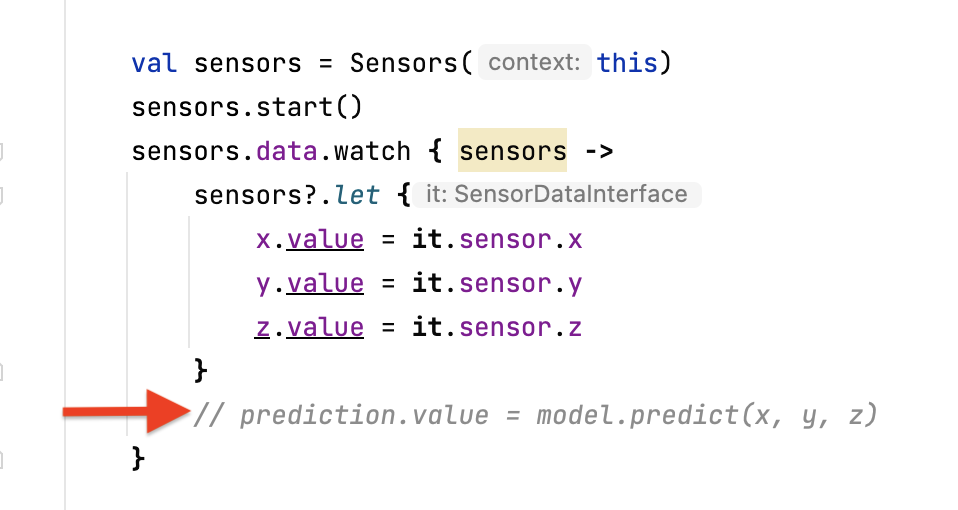
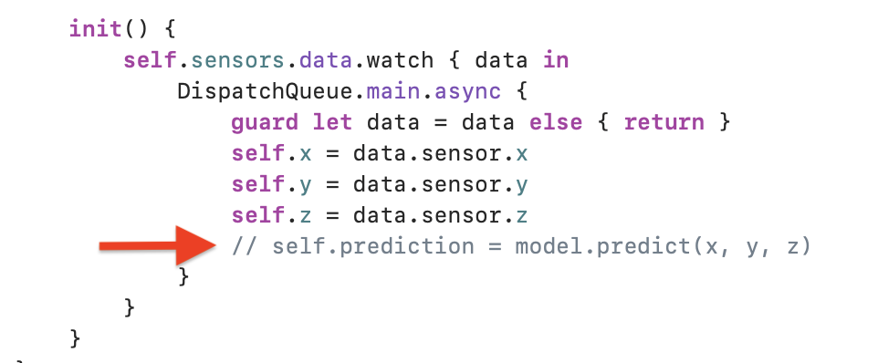
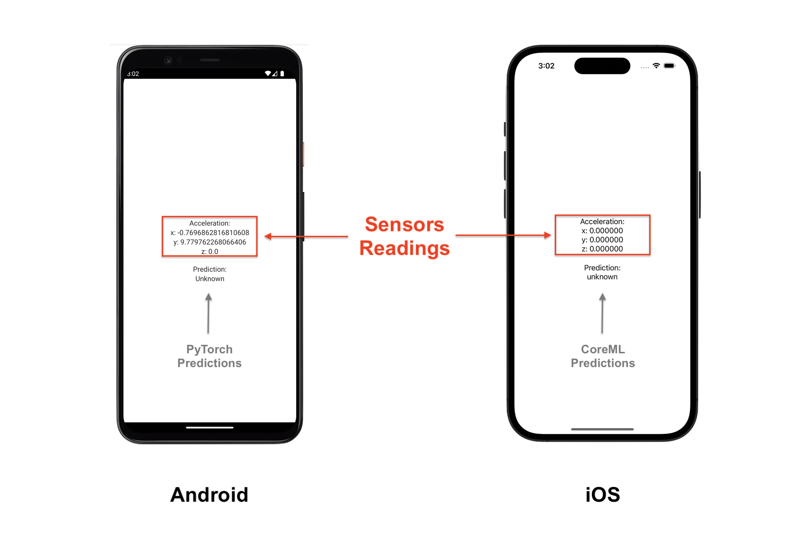

> Proof of concept mobile app for the activity recognition model
# Multi Platform Sensors App
A multi platform app that uses the same code base to run on iOS and Android. It read the accelerometer sensors and display the data in a view. The intend of this mobile app is to test the activity recognition Model develop in this repository. 

## Quick start
### iOS
Open the project located in the iosApp folder in Xcode and run the app.

### Android
Open the project from the root folder in Android Studio and run the app.

## Project structure
```
- androidApp: Contains the Android app
- iosApp: Contains the iOS app
- shared: Contains the shared code between the two apps. Where the sensor Data is read
```

### Prediction Model integration
The model should expose a predict interface:
```kotlin
fun predict(x: Double, y: Double, z: Double): String
```
```swift
func predict(x: Double, y: Double, z: Double) -> String
```

#### iOS
1. Import the coreML model in the `iosApp` folder
2. Call the `predict` function in the `ContentView.swift` file
<p align="center">

</p>

#### Android
1. Import the PyTorch model in the `androidApp` folder
2. Call the `predict` function in the `MainActivity.kt` file
<p align="center">

</p>

## User interface
<p align="center">

</p>